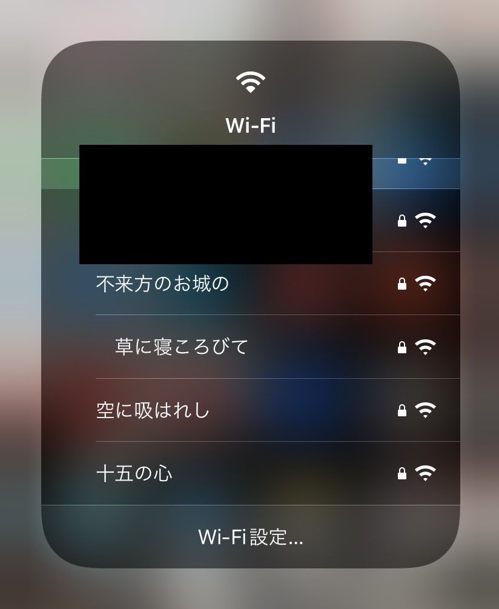

# one-grip-ssid

Wi-Fi 名を「一握の砂」の短歌にしつづけるやつ。



## 前提条件

* [石川啄木「一握の砂」](https://www.aozora.gr.jp/cards/000153/files/816_15786.html)
* [Buffalo WHR-1166DHP3](https://www.buffalo.jp/product/detail/whr-1166dhp3.html)

## 使い方

```
## ルーターの IP と認証情報の設定
$ vi .env
BUFFALO_IP="192.168.11.XX"
BUFFALO_USERNAME="admin"
BUFFALO_PASSWORD="some-password"

## 青空文庫から短歌をスクレイピングし songs.yaml に保存
$ docker-compose run --rm app bundle exec ruby scrape.rb

## 定期的に Wi-Fi 名を変更する処理を起動 (フォアグラウンド)
$ docker-compose run --rm app bundle exec ruby app.rb

## 定期的に Wi-Fi 名を変更する処理を起動 (バックグラウンド)
$ docker-compose up -d
```

## メモなど

* いまは行が 10 文字からはみでたときに 2 行に分ける処理が雑
    * 形態素解析などでもっと読みやすく分割するようにしたい
